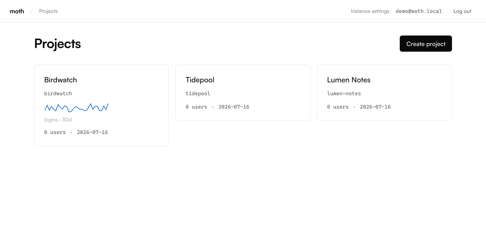
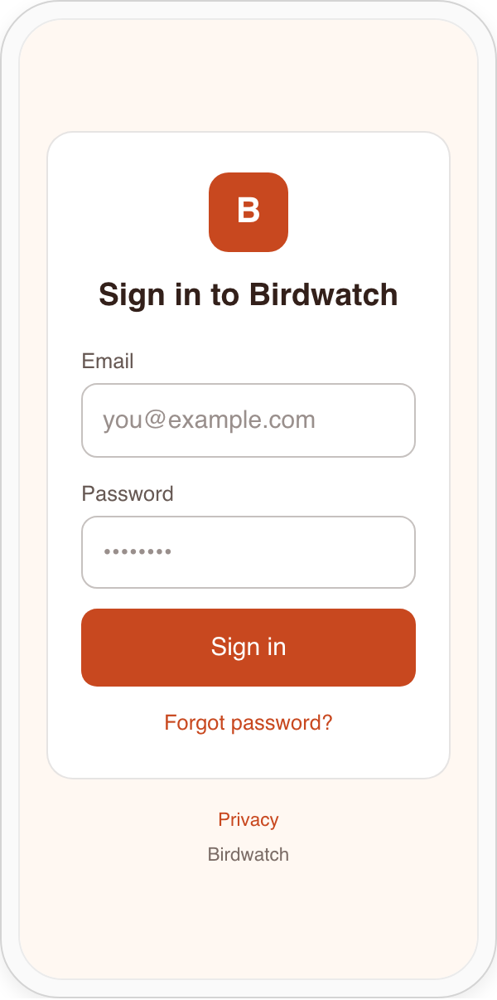
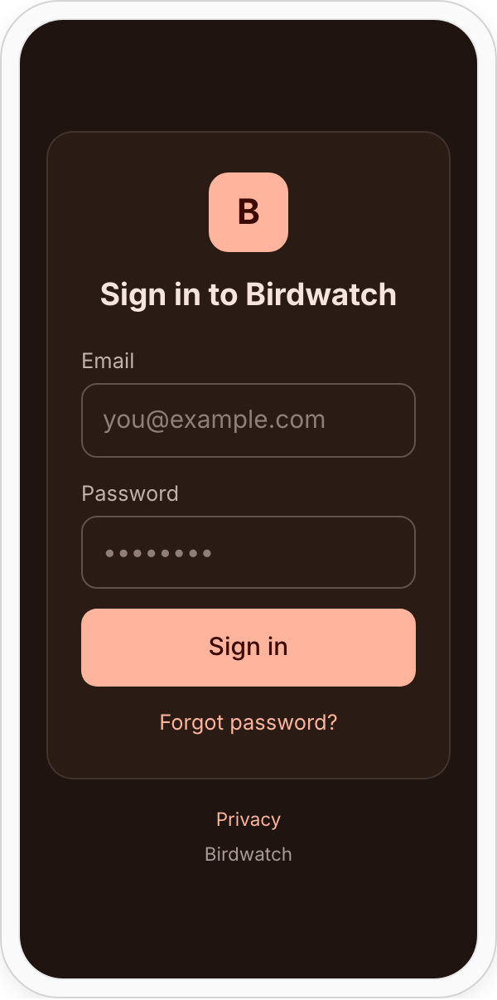

<h1 align="center">moth</h1>

<p align="center">
  <b>Self-hosted authentication for your mobile apps — in one binary.</b><br>
  One instance hosts your whole portfolio of apps. No SaaS bill, no lock-in.
</p>

<p align="center">
  <a href="https://aloisdeniel.github.io/moth/">Website & docs</a> ·
  <a href="https://aloisdeniel.github.io/moth/docs/quick-start/">Quick start</a> ·
  <a href="CHANGELOG.md">Changelog</a> ·
  <a href="LICENSE">MIT</a>
</p>

---

## What & why

moth is a single Go binary that gives your mobile apps sign-up, sign-in,
email verification, password reset, and Sign in with Google/Apple — backed by
per-project ES256 JWTs any standard library can verify offline.

It also monetizes them: App Store and Google Play subscription receipts are
validated **server-side** (no billing SaaS), the same tiers sell **on the
web** through Stripe-hosted Checkout, and everything is distilled into
**entitlements** like `pro` your app gates on, sold through a **themed
paywall** configured from the admin, and reported as revenue per month on
the analytics tab. A free tier is always built in, so paid subscriptions
stay optional.

Every app you ship is a **project**: a sealed tenant with its own users, its
own signing keypair, its own provider credentials, its own login branding,
its own subscription tiers, its own analytics. Adding app #10 costs what
app #1 did — one project created in the admin, zero new infrastructure.

Everything ships **inside the binary**: the SQLite database, the admin web
console, the hosted email pages, the fonts, the `moth_auth` Flutter SDK
(served from the instance's own pub repository), the `@moth/react` React
SDK (served from the instance's own npm registry), the CLI, and the
documentation you're reading (served at `/docs`, version-matched to the
binary). `moth serve` and you're running.

Reach for moth when you want Firebase-style auth for a portfolio of apps but
would rather own the data, the bill, and the deployment.

<p align="center">
  
  
  
</p>

## Quick start

Four steps from nothing to a logged-in Flutter app (full version in the
[quick start guide](https://aloisdeniel.github.io/moth/docs/quick-start/)):

```sh
# 1. Build the single binary (release binaries & Homebrew tap ship with v1.0).
make build            # → bin/moth

# 2. Run it. Open the admin, complete first-run setup, create a project,
#    and copy its publishable key (pk_…).
./bin/moth serve      # http://localhost:8080/admin

# 3. Add the SDK to your Flutter app from moth's own pub repository.
#    (dart pub speaks to the instance you just started.)
dart pub add moth_auth \
  --hosted-url http://localhost:8080/pub
#    React app instead? The instance serves an npm registry too:
#      echo '@moth:registry=http://localhost:8080/npm' >> .npmrc
#      npm install @moth/react

# 4. Point the client at your instance + project and sign a user in.
```

```dart
final moth = MothClient(
  baseUrl: 'http://localhost:8080',
  publishableKey: 'pk_...',
);
await moth.signUp(email: email, password: password);
final session = await moth.signIn(email: email, password: password);
// session.accessToken is an ES256 JWT verifiable against the project JWKS.
```

## Deploy it for real

moth is CGO-free and self-contained, so deployment is "copy the binary + one
data directory". The [installation guide](https://aloisdeniel.github.io/moth/docs/installation/)
covers `moth.toml`, a hardened systemd unit, Docker, and reverse proxies
(Caddy/Traefik/nginx) including the HTTP/2-end-to-end requirement native gRPC
needs. A scratch-based image is a `docker build .` away (see `Dockerfile`).

```sh
docker build -t moth .
docker run -d -p 8080:8080 -v moth-data:/data \
  -e MOTH_BASE_URL=https://auth.example.com moth
```

## Performance

argon2id password verification — deliberately slow — dominates `SignIn`
cost, so honest throughput is tens-to-low-hundreds of sign-ins per second per
core, with steady-state token refreshes far cheaper. moth ships a repeatable
`ghz` harness at [`scripts/loadtest/`](scripts/loadtest/) so you can measure
the number on *your* hardware. This project does not quote a load figure it
has not measured on the machine it attributes it to; recorded runs live in
[`scripts/loadtest/RESULTS.md`](scripts/loadtest/RESULTS.md).

## Development

See [CONTRIBUTING.md](CONTRIBUTING.md) and [`CLAUDE.md`](CLAUDE.md) for the
layout and conventions. Common targets:

| Command | What |
|---|---|
| `make build` | build `bin/moth` (embeds the SPA + docs) |
| `make test` | `go test ./...` |
| `make dev` | Go server on :8080 + Vite SPA on :5173 |
| `make proto` | regenerate `gen/` + the TS client |
| `make docs-embed` | re-sync the embedded `/docs` from the website |
| `make website` | build the public website |

## License

[MIT](LICENSE) © 2026 Aloïs Deniel. The `moth_auth` Flutter SDK is MIT too.
